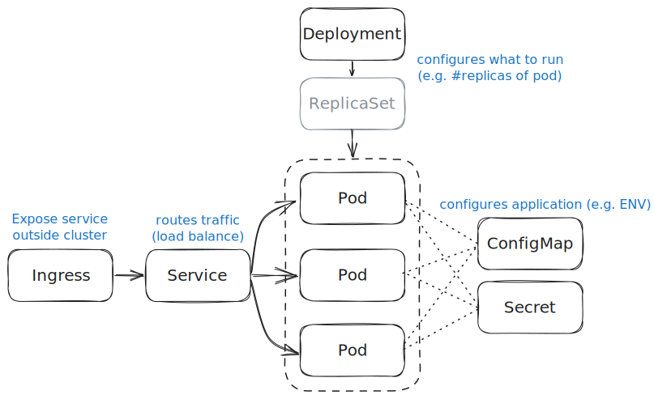

# Examples of Kubernetes resource manifests

Various examples of how to create Kubernetes resources.

The focus is on explaining the basic principles and skips of lot of details. Please consult the official [Kubernetes Documentation](https://kubernetes.io/docs/home/) for a more thorough walkthrough of all concepts.

> ⚠️ These examples are ***not*** demonstrations of "best practices" for production-ready deployments!

## Typical application

* One or more [Pods](https://kubernetes.io/docs/concepts/workloads/pods/) for executing the applications (~ "running them")
* [ConfigMaps](https://kubernetes.io/docs/concepts/configuration/configmap/) and [Secrets](https://kubernetes.io/docs/concepts/configuration/secret/) to hold application configuration settings
* [Deployment](https://kubernetes.io/docs/concepts/workloads/controllers/deployment/) (and [ReplicaSets](https://kubernetes.io/docs/concepts/workloads/controllers/replicaset/)) that declares which pods to run (and how)
* [Service](https://kubernetes.io/docs/concepts/services-networking/service/) resources to expose network applications running in pods to other workloads within the cluster
* Sometimes also [Ingress](https://kubernetes.io/docs/concepts/services-networking/ingress/) resources for exposing services outside the cluster



## Managing resources

Resources and be created in multiple ways. Two common options are:

* Explicit `create` sub-commands of `kubectl` CLI with various options depending on resource type
* Using `kubectl` to create/apply a "manifest file" (usually `yaml` format) specifying the desired resource(s)

Examples of these two options are shown in the sections below.

> ***How to delete?***
>
> Run `kubectl delete`, and specify the resource by name. Or, if it was created via a manifest file, point out that file via the `-f` option.
>
> *Examples*:
>
> ```shell
> kubectl delete pod my-pod
> ```
>
> ```shell
> kubectl delete -f my-manifest.yaml
> ```

## Create a Pod

Pods encapsulate creation and execution of one or more containers (often a single container). You can think of it as configuration of all parameters you need to specify when running a container (similar to what you provide to `docker run`), for example:

* Which container image to run
* Assignment of environment variables
* _and much more..._

The "one-liner" for just-in-time creation:

```shell
kubectl run example --image=ghcr.io/uivraeus/cpp-example:latest --env="APP_ITERATION_DELAY=11"
```

It is usually easier to specify all details in a separate _manifest_ file, like [example-pod.yaml](./example-pod.yaml):

```shell
kubectl apply -f ./example-pod.yaml
```

> For a complete application, pods are usually created implicitly via Deployment resources, not explicitly like in these examples.

Read more about Pods in the [official Kubernetes documentation](https://kubernetes.io/docs/concepts/workloads/pods/).

## Create a ConfigMap

ConfigMaps typically hold "configuration" of applications running inside Pods. Sometimes they hold content which is mounted as files within the Pod's (container's) file system. Other times they define properties which are mounted as environment variables within the container.

The following examples show how to create ConfigMaps which are are used for mounting environment variables.

The "one-liner" for just-in-time creation:

```shell
kubectl create configmap app-config --from-literal=BG_COLOR=darkgreen --from-literal=TEXT_COLOR=white
```

The same definition can be created via a separate _manifest_ file, like [app-configmap.yaml](./app-configmap.yaml)

```shell
kubectl apply -f ./app-configmap.yaml
```

Refer to the section on Deployments below for examples of how ConfigMaps are used to mount environment variables into Pods.

Read more about ConfigMaps in the [official Kubernetes documentation](https://kubernetes.io/docs/concepts/configuration/configmap/).

## Create a Secret

Secrets are very similar to ConfigMaps as they can be used to specify configuration that ends up either as files in the Pod's filesystem or as environment variables in it. Within Kubernetes they are treated as a separate resource type with specific access control and separated storage. But for a _user_ of Kubernetes, the only visible difference is that the _values_ are stored in [Base64 encoded](https://en.wikipedia.org/wiki/Base64) format (not encrypted).

The Secret resources are typically used to specify configuration of sensitive information like passwords, API-keys and TLS certificates  (with private keys).

The easiest way of creating a secret is by using the CLI "one-liner":

```shell
kubectl create secret generic app-secret --from-literal=PASSWORD=s3cr3t
```

It is also possible to creating it via a _manifest_ file like [app-secret.yaml](./app-secret.yaml), but note that the values in this file must be Base64 encoded.

```shell
kubectl apply -f ./app-secret.yaml
```

Refer to the section on Deployments below for examples of how Secrets are used to mount environment variables into Pods.

Read more about Secrets in the [official Kubernetes documentation](https://kubernetes.io/docs/concepts/configuration/secret/).
