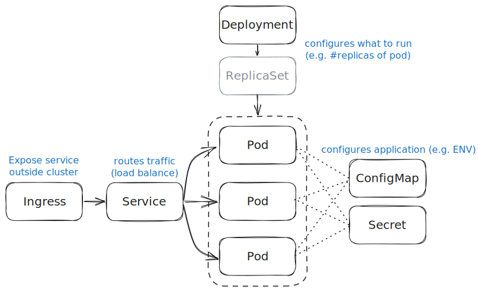

# Examples of Kubernetes resource manifests

Various examples of how to create Kubernetes resources.

The focus is on explaining the basic principles and skips of lot of details. Please consult the official [Kubernetes Documentation](https://kubernetes.io/docs/home/) for a more thorough walkthrough of all concepts.

> ⚠️ These examples are ***not*** demonstrations of "best practices" for production-ready deployments!

## Typical application

* One or more [Pods](https://kubernetes.io/docs/concepts/workloads/pods/) for executing the applications (~ "running them")
* [ConfigMaps](https://kubernetes.io/docs/concepts/configuration/configmap/) and [Secrets](https://kubernetes.io/docs/concepts/configuration/secret/) to hold application configuration settings
* [Deployment](https://kubernetes.io/docs/concepts/workloads/controllers/deployment/) (and [ReplicaSets](https://kubernetes.io/docs/concepts/workloads/controllers/replicaset/)) that declares which pods to run (and how)
* [Service](https://kubernetes.io/docs/concepts/services-networking/service/) resources to expose network applications running in pods to other workloads within the cluster
* Sometimes also [Ingress](https://kubernetes.io/docs/concepts/services-networking/ingress/) resources for exposing services outside the cluster



## Managing resources

Resources and be created in multiple ways. Two common options are:

* Explicit `create` sub-commands of `kubectl` CLI with various options depending on resource type
* Using `kubectl` to create/apply a "manifest file" (usually `yaml` format), which specifies the desired resource(s)

Examples of these two options are shown in the sections below.

> ***How to delete?***
>
> Run `kubectl delete`, and specify the resource by name. Or, if it was created via a manifest file, point out that file via the `-f` option.
>
> *Examples*:
>
> ```shell
> kubectl delete pod my-pod
> ```
>
> ```shell
> kubectl delete -f my-manifest.yaml
> ```

> ***How to inspect?***
>
> You can use the `describe` sub-command of `kubectl` to retrieve status and information on a specific resource, e.g.:
>
> ```shell
> kubectl describe pod my-pod
> ```
>
> You can use the `get` sub-command of `kubectl` for querying which resources that are defined and to obtain the details of them.
>
> List all Pods:
>
> ```shell
> kubectl get pod
> ```
>
> Get the manifest (in yaml format) of a specific pod:
>
> ```shell
> kubectl get pod my-pod -o yaml
> ```

## Initial check

Before creating/updating resources in the cluster, you can confirm that your tools are properly configured and that you are connected to the right/desired cluster.

```shell
kubectl get nodes
```

## Create a Pod

Pods encapsulate creation and execution of one or more containers (often a single container). You can think of it as configuration of all parameters you need to specify when running a container (similar to what you provide to `docker run`), for example:

* Which container image to run
* Assignment of environment variables
* _and much more..._

The "one-liner" for just-in-time creation:

```shell
kubectl run example --image=ghcr.io/uivraeus/cpp-example:1.0.0 --env="APP_ITERATION_DELAY=11"
```

It is usually easier to specify all details in a separate _manifest_ file, like [example-pod.yaml](./example-pod.yaml):

```shell
kubectl apply -f ./example-pod.yaml
```

You can get the logs from a specific Pod by using the `logs` sub-command:

```shell
kubectl logs example
```

(add the `-f` option to trigger continuous "follow mode" for the logs)

> For a complete application, pods are usually created implicitly via Deployment resources, not explicitly like in these examples.

Read more about Pods in the [official Kubernetes documentation](https://kubernetes.io/docs/concepts/workloads/pods/).

## Create a ConfigMap

ConfigMaps typically hold "configuration" of applications running inside Pods. Sometimes they hold content which is mounted as files within the Pod's (container's) file system. Other times they define properties which are mounted as environment variables within the container.

The following examples show how to create ConfigMaps which are are used for mounting environment variables.

The "one-liner" for just-in-time creation:

```shell
kubectl create configmap app-config --from-literal=BG_COLOR=darkgreen --from-literal=TEXT_COLOR=white
```

The same definition can be created via a separate _manifest_ file, like [app-configmap.yaml](./app-configmap.yaml)

```shell
kubectl apply -f ./app-configmap.yaml
```

Refer to the section on Deployments below for examples of how ConfigMaps are used to mount environment variables into Pods.

Read more about ConfigMaps in the [official Kubernetes documentation](https://kubernetes.io/docs/concepts/configuration/configmap/).

## Create a Secret

Secrets are very similar to ConfigMaps as they can be used to specify configuration that ends up either as files in the Pod's filesystem or as environment variables in it. Within Kubernetes they are treated as a separate resource type with specific access control and separated storage. But for a _user_ of Kubernetes, the only visible difference is that the _values_ are stored in [Base64 encoded](https://en.wikipedia.org/wiki/Base64) format (not encrypted).

The Secret resources are typically used to specify configuration of sensitive information like passwords, API-keys and TLS certificates  (with private keys).

The easiest way of creating a secret is by using the CLI "one-liner":

```shell
kubectl create secret generic app-secret --from-literal=PASSWORD=s3cr3t
```

It is also possible to creating it via a _manifest_ file like [app-secret.yaml](./app-secret.yaml), but note that the values in this file must be Base64 encoded.

> ⚠️ Never commit files with actual secrets in plaintext (or base64 encoded) to Git!

```shell
kubectl apply -f ./app-secret.yaml
```

Refer to the section on Deployments below for examples of how Secrets are used to mount environment variables into Pods.

Read more about Secrets in the [official Kubernetes documentation](https://kubernetes.io/docs/concepts/configuration/secret/).

## Create a Deployment (incl a ReplicaSet)

By defining Deployments, you tell Kubernetes what kind of Pod you want and how many _replicas_ of it that shall exists. The difference between creating the pods manually, like shown above, and doing it via Deployments, is that Kubernetes will (try to) ensure that the specified number of pods always exists.

So, if you delete a pod created indirectly via a Deployment, Kubernetes will automatically create a new replacement for it.

> To actually delete the Pods, you must delete the corresponding Deployment resource.

Although it is possible to create Deployments directly via the CLI it is easier to get all details right by doing it via a separate _manifest_ file, like [app-deployment.yaml](./app-deployment.yaml). This example also shows how to mount environment variables from ConfigMaps and Secrets.

```shell
kubectl apply -f ./app-deployment.yaml
```

When a Deployment is created (or updated) Kubernetes automatically creates a _ReplicaSet_, which in turn creates the specified amount of Pods. This intermediary step enables support for "rolling back changes" (among other things). Read more about Deployments in the [official Kubernetes documentation](https://kubernetes.io/docs/concepts/workloads/controllers/deployment/).

## Create a Service

You defined a Service resource to expose a network application (server) running in a pod (or several) to other network clients running in your cluster. This will make the application addressable via a service name as well as a common IP address which is essential when there are multiple Pods (replicas) running.

> Although it is possible to create a service which can be addressed from _outside_ the cluster, that is typically not how external access is managed. See the section below for further information.

The Service resource, which targets specific Pods by their labels, maps a specific TCP port of the service to a specific port in the Pod (container). It is thus required to know which port(s) the application within the Pod listens on when defining the Service.

You can create a Service using the following "one-liner" to expose the pods of the Deployment created above (via its manifest file)

```shell
kubectl expose -f app-deployment.yaml --name app-service --port=80 --target-port=8080
```

In this example, the application within the Pod (on port 8080) will (also) be available via the Service `app-service` on port 80.

As always, it is possible (and usually preferred) to crete the resource via a dedicated _manifest_ file, like [app-service.yaml](./app-service.yaml).

```shell
kubectl apply -f ./app-service.yaml
```

Read more about Services in the [official Kubernetes documentation](https://kubernetes.io/docs/concepts/services-networking/service/).

## Accessing your application from outside the cluster

### Create an Ingress

You have defined a service which exposes your pod to other resources within the cluster but what if you want to expose your service to the outside world? You would then use an Ingress resource which maps an externally addressable domain/host name (e.g. `jokes.example.com`) to your service.

The simplest way of deploying an ingress is from a _manifest_ file, like the one available in [app-ingress.yaml](./app-ingress.yaml), using the following command:
 ```shell
 kubectl apply -f ./app-ingress.yaml
 ```
 The _manifest_ specifies the address of the host, the service to which we want to route the traffic, the corresponding port number, as well as the available paths. The ingress also gives you the option of using TLS by providing it with a TLS-secret. The TLS-secret needs to be stored as a kubernetes secret within the same namespace as the ingress and it is the name of said secret that you provide within the _manifest_.

 Please refer to the [official Kubernetes documentation](https://kubernetes.io/docs/concepts/services-networking/ingress/) for details around Ingress definitions.

### During debug or development

You can use the CLI to do a "port-forward" to any running Pod or Service in the cluster. By default, the application then becomes reachable via a port on your "localhost" (127.0.0.1).

The following example shows how to make the Service created above reachable at [http://127.0.0.1:8080](http://127.0.0.1:8080) on your machine.

```shell
kubectl port-forward svc/app-service 8080:80
```

(Hit `Ctrl+C` to terminate the port-forward)